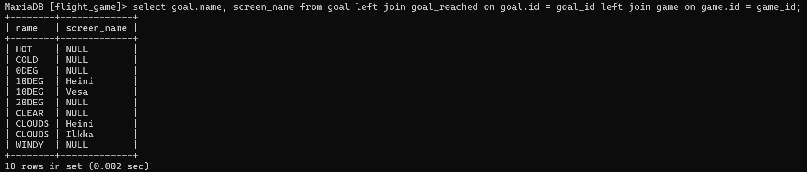

### Tehtävä 1
select country.name as "country name", airport.name as "airport name" from airport inner join country on airport.iso_country = country.iso_country where country.name = "Finland" and scheduled_service = "yes";

### Tehtävä 2
select screen_name, airport.name from airport inner join game on airport.ident = game.location;

### Tehtävä 3
select screen_name, country.name from game inner join airport on airport.ident = game.location inner join country on airport.iso_country = country.iso_country;

### Tehtävä 4
select airport.name, game.screen_name from airport left join game on airport.ident = game.location where airport.name like "%Hels%";

### Tehtävä 5
select goal.name, screen_name from goal left join goal_reached on goal.id = goal_id left join game on game.id = game_id;
