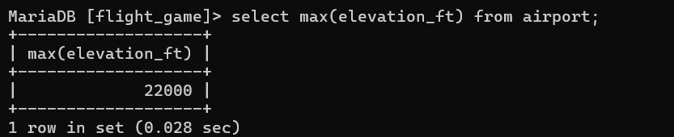
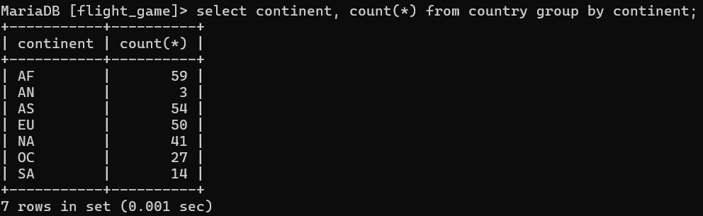
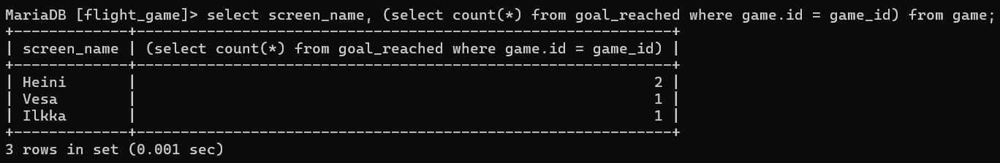
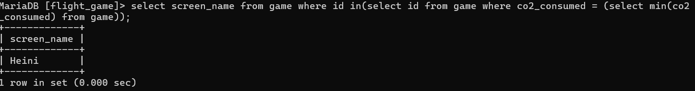
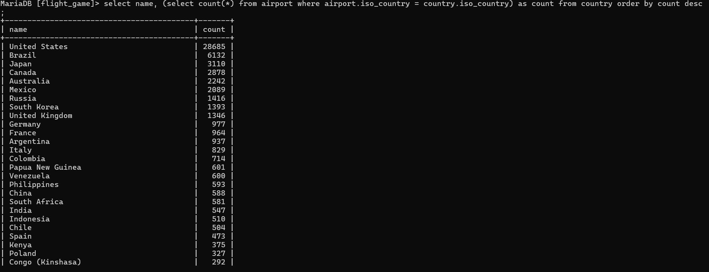
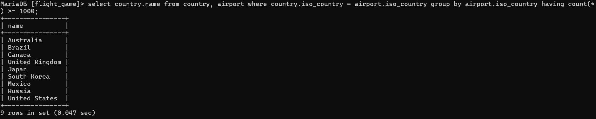
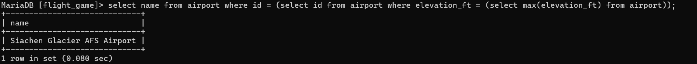
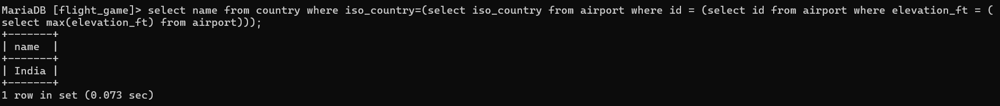
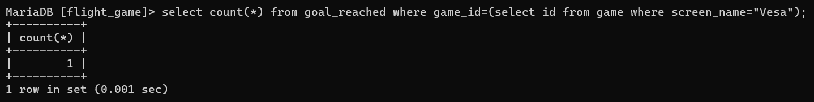
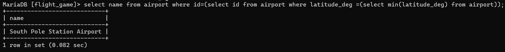

### Tehtävä 1
select max(elevation_ft) from airport;

### Tehtävä 2
select continent, count(*) from country group by continent;

### Tehtävä 3
select screen_name, (select count(*) from goal_reached where game.id = game_id) from game;

### Tehtävä 4
select screen_name from game where id in(select id from game where co2_consumed = (select min(co2
_consumed) from game));

### Tehtävä 5
select name, (select count(*) from airport where airport.iso_country = country.iso_country) as count from country order by count desc;

### Tehtävä 6
select country.name from country, airport where country.iso_country = airport.iso_country group by airport.iso_country having count(*) >= 1000;

### Tehtävä 7
select name from airport where id = (select id from airport where elevation_ft = (select max(elevation_ft) from airport));

### Tehtävä 8
select name from country where iso_country=(select iso_country from airport where id = (select id from airport where elevation_ft = (select max(elevation_ft) from airport)));

### Tehtävä 9
select count(*) from goal_reached where game_id=(select id from game where screen_name="Vesa");

### Tehtävä 10
select country.name from goal, goal_reached, game, airport, country where goal_reached.game_id = game.id and airport.iso_country = country.iso_country and goal_reached.goal_id = goal.id and game.location = airport.ident and goal.name = "clouds" and game.screen_name = "Ilkka";
