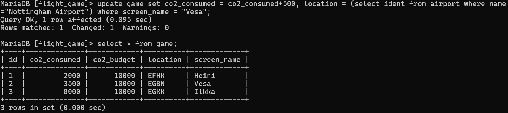
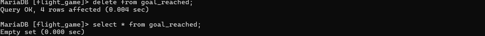
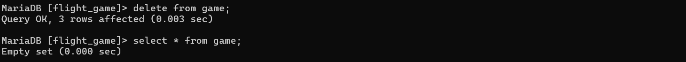

### Tehtävä 1
update game set co2_consumed = co2_consumed+500, location = (select ident from airport where name="Nottingham Airport") where screen_name = "Vesa";

### Tehtävä 3
delete from goal_reached;

### Tehtävä 4
delete from game;

