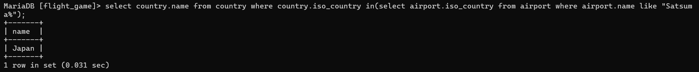
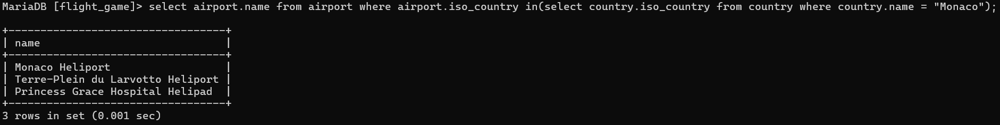
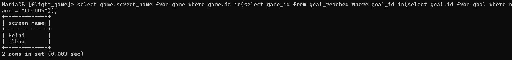
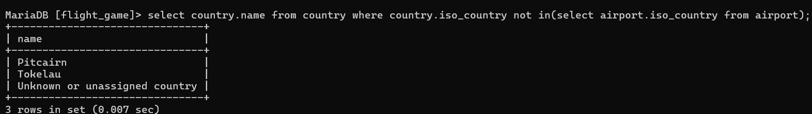
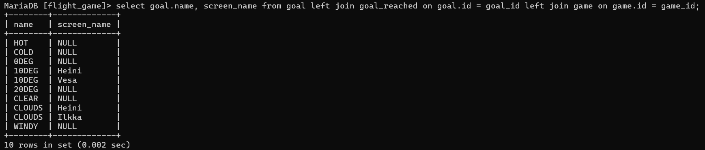

### Tehtävä 1
select country.name from country where country.iso_country in(select airport.iso_country from airport where airport.name like "Satsuma%");

### Tehtävä 2
select airport.name from airport where airport.iso_country in(select country.iso_country from country where country.name = "Monaco");

### Tehtävä 3
select game.screen_name from game where game.id in(select game_id from goal_reached where goal_id in(select goal.id from goal where name = "CLOUDS"));

### Tehtävä 4
select country.name from country where country.iso_country not in(select airport.iso_country from airport);

### Tehtävä 5
select goal.name from goal where goal.id not in(select goal_id from goal_reached where game_id not in(select game.id from game where screen_name = "Heini"));
