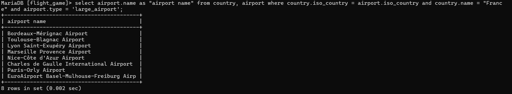

### Tehtävä 1
select country.name as "country name", airport.name as "airport name" from country, airport where country.iso_country = airport.iso_country and country.name = "Iceland";

### Tehtävä 2
select airport.name as "airport name" from country, airport where country.iso_country = airport.iso_country and country.name = "France" and airport.type = 'large_airport';

### Tehtävä 3
select country.name as "country name", airport.name as "airport name" from country, airport where country.iso_country = airport.iso_country and country.continent = "AN";

### Tehtävä 4
select airport.elevation_ft from airport, game where airport.ident = game.location and game.screen_name = "Heini";

### Tehtävä 5
select airport.elevation_ft * 0.3048 as elevation_m from airport, game where airport.ident = game.location and game.screen_name = "Heini";

### Tehtävä 6
select airport.name from airport, game where airport.ident = game.location and game.screen_name = "Ilkka";

### Tehtävä 7
select country.name from airport, game, country where airport.ident = game.location and airport.iso_country = country.iso_country and game.screen_name = "Ilkka";

### Tehtävä 8
select goal.name from goal, goal_reached, game where goal_reached.game_id = game.id and goal_reached.goal_id = goal.id and game.screen_name = "Heini";

### Tehtävä 9
select airport.name from goal, goal_reached, game, airport where goal_reached.game_id = game.id and goal_reached.goal_id = goal.id and game.location = airport.ident and goal.name = "clouds" and game.screen_name = "Ilkka";

### Tehtävä 10
select country.name from goal, goal_reached, game, airport, country where goal_reached.game_id = game.id and airport.iso_country = country.iso_country and goal_reached.goal_id = goal.id and game.location = airport.ident and goal.name = "clouds" and game.screen_name = "Ilkka";
